# Continuous Integration

## Part A
- Test **java.util.PriorityQueue class** with Junit.
    - import java.util.PriorityQueue; 
- Parameterization 
    - Each testcase : { random array } , { correct array }. 
        - Random array means to specify **your own input array**. 
        - Correct array means the **PriorityQueue polling correct order** instead of using toArray(). 
        - e.g. arguments(new int[]{5, 4, 2, 3}, new int[]{2, 3, 4, 5}); 
    - Your test must have at least **5** unique testcases. 
- Exception 
    - You have to test at least **3** unique Exceptions that is thrown by PriorityQueue. 
    - The same type of exception in different ways is accepted.

## Part B
- Travis-CI
    - Authorize Travis CI with your Github account.
    - Make sure that Travis CI can be built and test automatically.
- Github
  - Deploy your **Part A (PriorityQueueTest.java)** on Github in public.
  - The name of repository : **ST-2022-student_id**
  - You have to commit twice:
    - Pass all test cases
    - Unable to pass one of the test cases
  - Add Travis CI status image and screenshots (both pass and fail) to your **README.md**.
- Submit your Github repository link to E3.

## Test result using GitHub action

- Success
  - Pull request
    [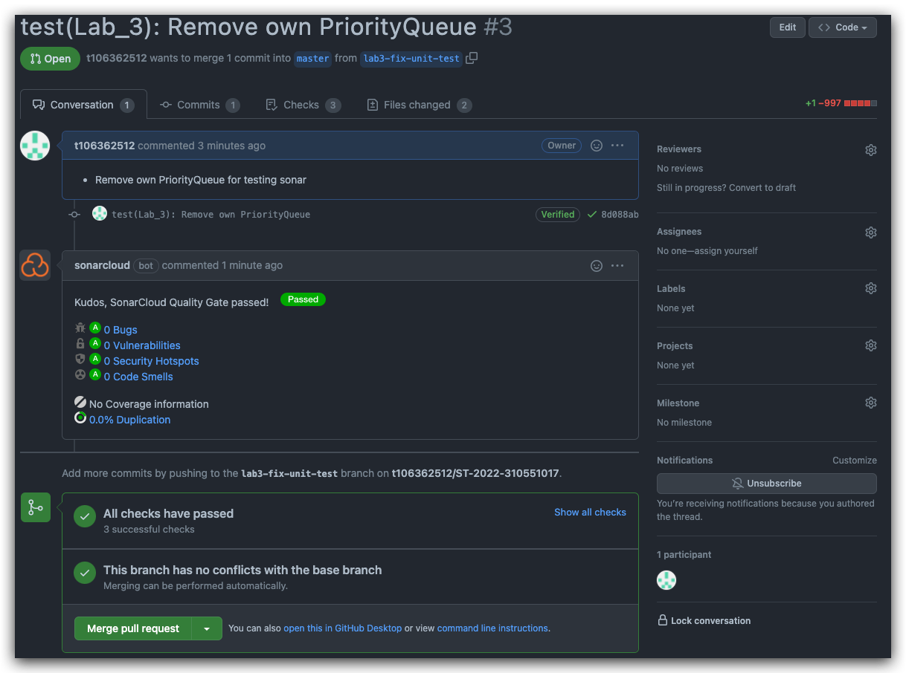](https://github.com/t106362512/ST-2022-310551017/pull/3)
  - GitHub action build status badge
    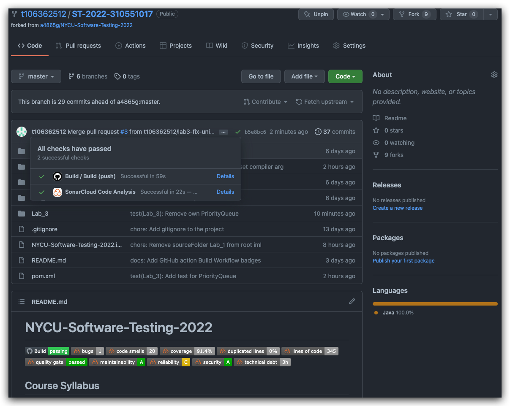
  - GitHub action build job
    [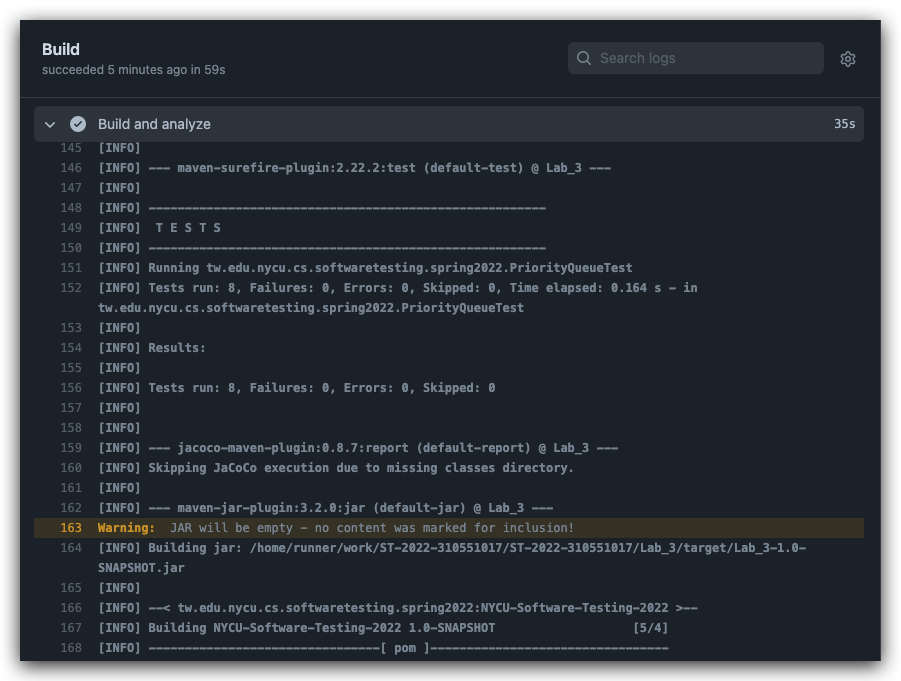](https://github.com/t106362512/ST-2022-310551017/runs/5529004792?check_suite_focus=true)
  - SonarQube(建置成功，但因只上傳測試程式，所以沒有啥好檢測的)
    [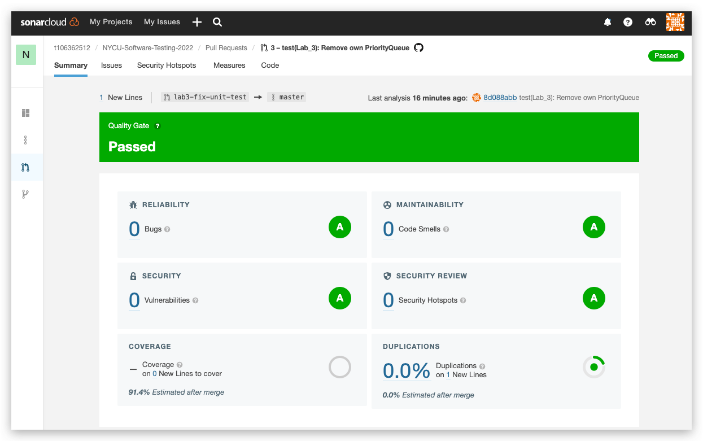](https://sonarcloud.io/summary/new_code?id=t106362512_NYCU-Software-Testing-2022&pullRequest=3)
  - SonarQube(目前整個 repo 之 master 分支的狀態)
    [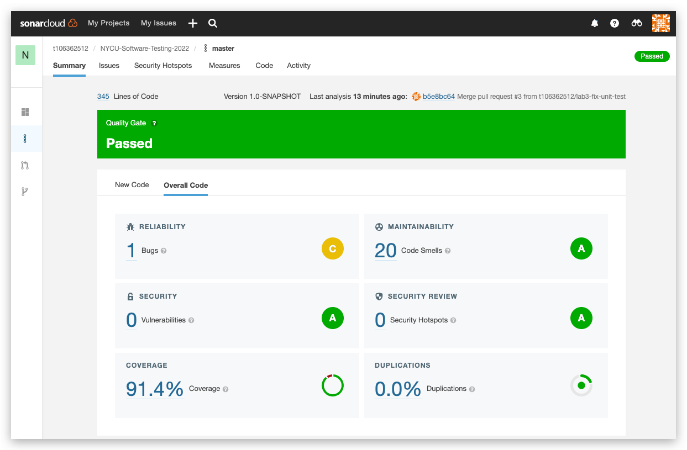](https://sonarcloud.io/summary/overall?id=t106362512_NYCU-Software-Testing-2022)

- Fail
  - Pull request
    [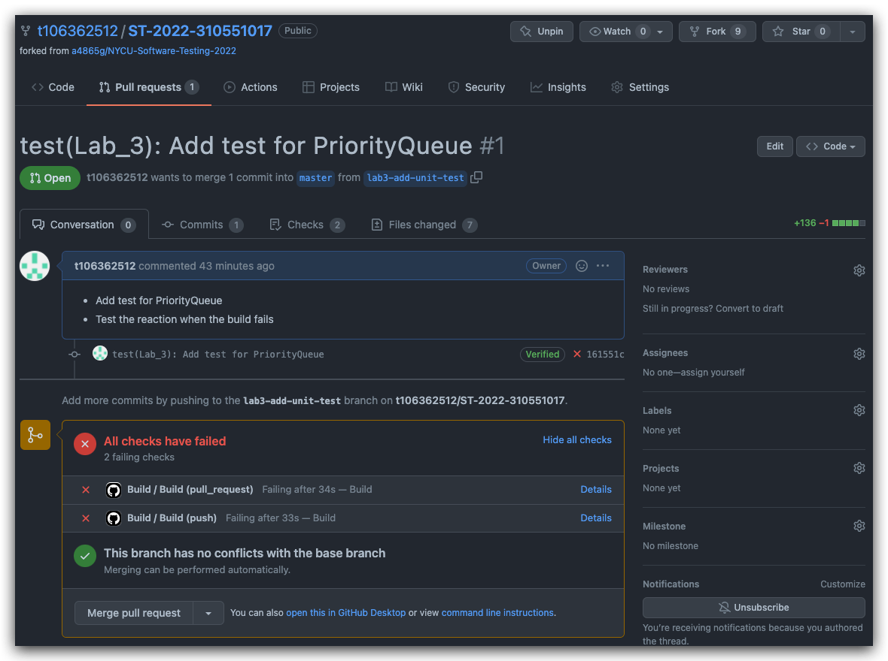](https://github.com/t106362512/ST-2022-310551017/pull/1)
  - GitHub action build status badge
    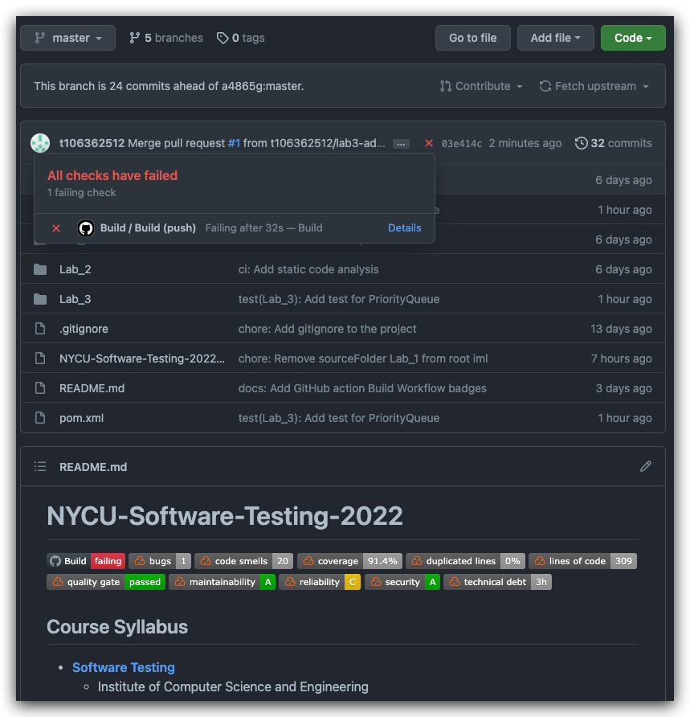
  - GitHub action build job
    [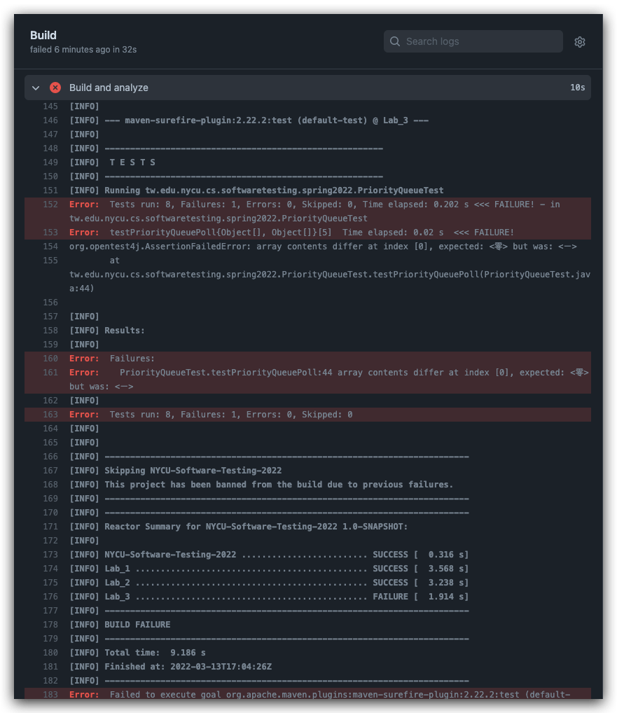](https://github.com/t106362512/ST-2022-310551017/runs/5528777232?check_suite_focus=true)
  - SonarQube(建置成功，但因測試涵蓋率過低，導致未通過品質門檻)
    [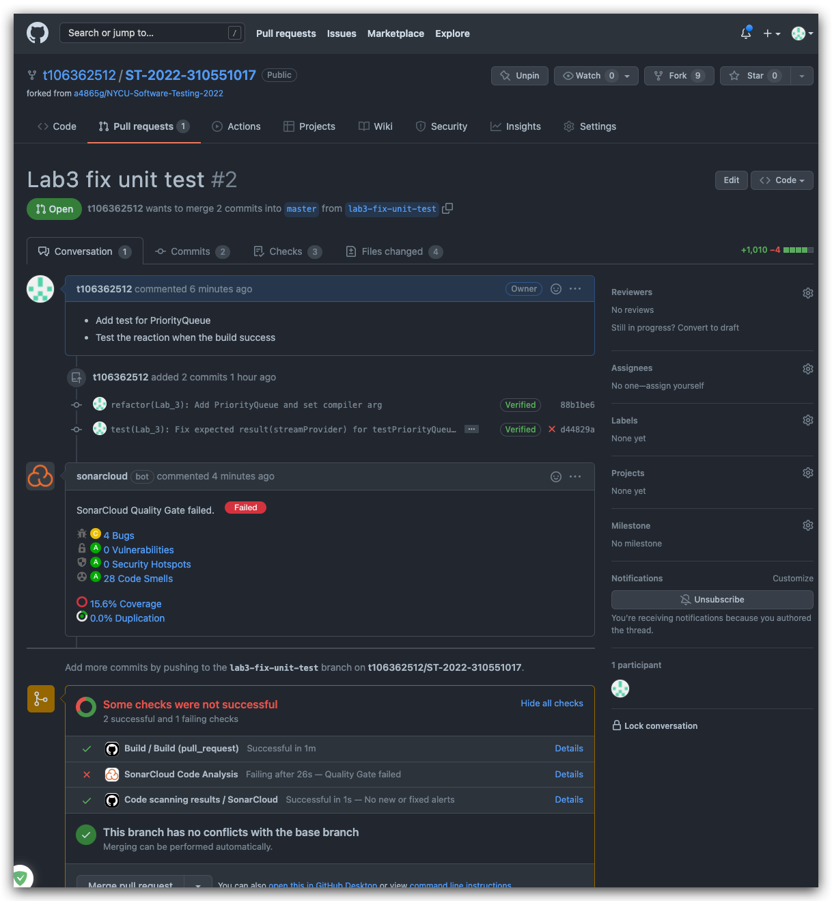](https://github.com/t106362512/ST-2022-310551017/pull/2)
    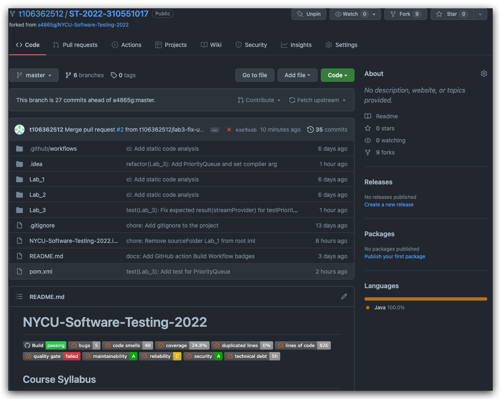
    [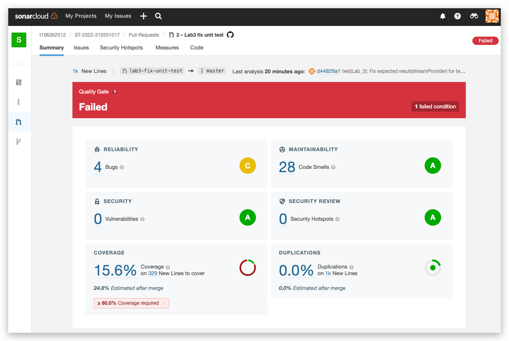](https://sonarcloud.io/summary/new_code?id=t106362512_NYCU-Software-Testing-2022&pullRequest=2)
    
